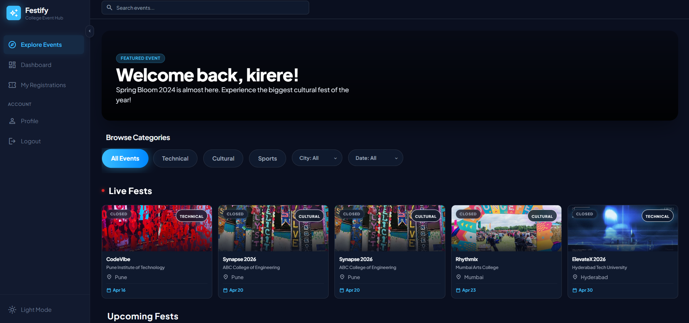
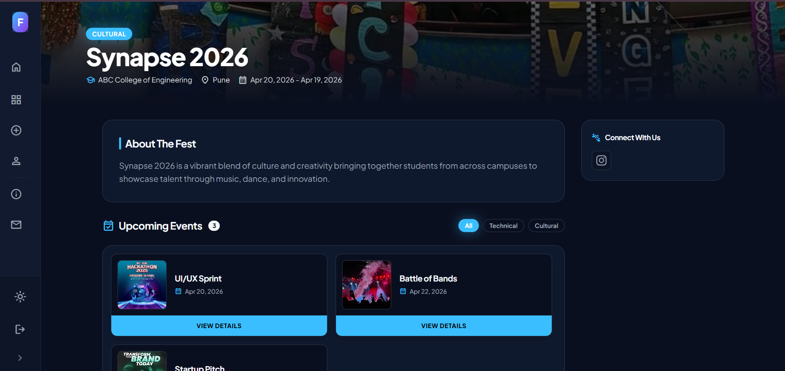
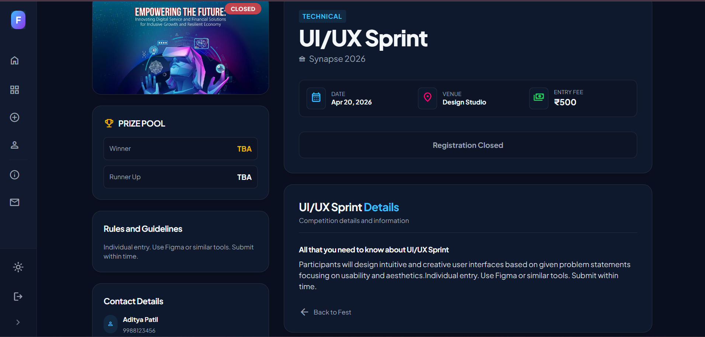
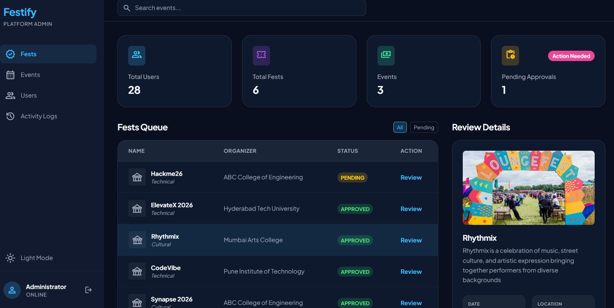

# Festify 🎉

A full-stack college event management platform for students, organizers, and admins.

**🔗 Live Demo:** [festify-six.vercel.app](https://festify-six.vercel.app)

React 18 · Vite · Tailwind CSS · Firebase · Razorpay · Vercel

---

## 📸 Screenshots

<table>
  <tr>
    <td></td>
    <td></td>
  </tr>
  <tr>
    <td></td>
    <td></td>
  </tr>
</table>

---

## 🧠 What Is Festify?

Festify digitalizes the entire college fest lifecycle — from fest creation and event registration to payment verification and admin approvals — through a structured three-role platform.

| Role | Responsibility |
|------|---------------|
| 🎓 **Student** | Discover fests, register for events, pay and track status |
| 🏢 **Organizer** | Create fests & events, configure payments, verify registrations |
| 🛡️ **Admin** | Approve fests & events, manage users, monitor the platform |

---

## ✨ Features

<details>
<summary><strong>🎓 Student</strong></summary>

- Browse and search fests by name, college, category, city, or date
- Register for free or paid events with a custom registration form
- Pay via **Razorpay** (instant verification) or **manual QR/UPI** (screenshot upload + transaction ID)
- Track registration and payment verification status in real time
- Receive an automatic email confirmation with full event details after registration
- Manage personal profile information

</details>

<details>
<summary><strong>🏢 Organizer</strong></summary>

- Multi-step fest creation with a custom registration form builder
- Create free or paid events with configurable payment methods
- Upload a UPI QR code for manual payments or integrate Razorpay for automated checkout
- Verify or reject student payment proofs from a dedicated dashboard
- Track total funds collected per event in real time
- Export complete registration and payment data as CSV

</details>

<details>
<summary><strong>🛡️ Admin</strong></summary>

- Approve, reject, or request changes on fests and events with comment feedback
- Manage all users across the platform
- View platform-wide analytics and pending approval queue
- Cascade delete a fest along with all its associated events

</details>

---

## 🛠️ Tech Stack

| Layer | Technology |
|-------|-----------|
| Frontend | React 18 + Vite |
| Styling | Tailwind CSS |
| Routing | React Router v6 |
| State Management | React Context API |
| Authentication | Firebase Auth — Email/Password + Google Sign-In |
| Database | Firebase Firestore |
| Image Hosting | ImgBB API |
| Email Notifications | EmailJS |
| Payments | Razorpay + Manual QR/UPI |
| Deployment | Vercel |

---

## 🏗️ Architecture

```
┌──────────────────────────────────────┐
│         React 18 + Vite              │
│     Tailwind CSS · Router v6         │
└────────────────┬─────────────────────┘
                 │
     ┌───────────┼────────────┐
     ▼           ▼            ▼
Firebase Auth  Firestore   ImgBB API
(Auth flows)  (App data)  (Images/QR)
     │
 ┌───┴────┐
 ▼        ▼
EmailJS  Razorpay
```

---

## 🔄 User Workflow

```
Student   →  Registers for Event  →  Pays (Razorpay or QR upload)
                                              │
Organizer ←────────────────────  Verifies Payment Proof
                                              │
Admin     ←──────────────────── Approves Fests & Events
```

**Payment flow detail:**
- **Free events** — direct registration, no payment step
- **Razorpay** — student pays → instant verification → confirmed
- **Manual QR** — student pays → uploads screenshot → organizer verifies → confirmed

---

## 🚀 Getting Started

### Prerequisites

- Node.js v16+
- Firebase project ([console.firebase.google.com](https://console.firebase.google.com))
- ImgBB API key — free at [api.imgbb.com](https://api.imgbb.com)
- EmailJS account — free at [emailjs.com](https://www.emailjs.com) *(optional, for email confirmations)*
- Razorpay account — [razorpay.com](https://razorpay.com) *(optional, for payment gateway)*

### 1. Clone & Install

```bash
git clone https://github.com/Shriya-25/Festify.git
cd Festify
npm install
```

### 2. Environment Variables

Create a `.env` file in the project root:

```env
# Firebase
VITE_FIREBASE_API_KEY=
VITE_FIREBASE_AUTH_DOMAIN=
VITE_FIREBASE_PROJECT_ID=
VITE_FIREBASE_STORAGE_BUCKET=
VITE_FIREBASE_MESSAGING_SENDER_ID=
VITE_FIREBASE_APP_ID=
VITE_FIREBASE_MEASUREMENT_ID=

# ImgBB
VITE_IMGBB_API_KEY=

# EmailJS (optional)
VITE_EMAILJS_SERVICE_ID=
VITE_EMAILJS_TEMPLATE_ID=
VITE_EMAILJS_PUBLIC_KEY=
```

### 3. Firebase Setup

1. Create a project at [console.firebase.google.com](https://console.firebase.google.com)
2. Enable **Authentication** → Email/Password + Google Sign-In
3. Create a **Firestore Database** in production mode
4. Deploy Firestore security rules:

```bash
npm install -g firebase-tools
firebase login
firebase deploy --only firestore:rules
```

5. Paste your Firebase config values into `.env`

### 4. Run Locally

```bash
npm run dev
# → http://localhost:5173
```

### 5. Build for Production

```bash
npm run build
```

---

## ☁️ Deploying to Vercel

```bash
npm install -g vercel
vercel login
vercel --prod
```

- Add all `VITE_*` variables under **Vercel → Project Settings → Environment Variables**
- Add your Vercel domain to **Firebase Console → Authentication → Authorized Domains**

---

## 🔐 Role System

Roles are stored in Firestore at `users/{uid}.role` and are **not self-assignable**.

| Role | How Assigned | Access |
|------|-------------|--------|
| `student` | Default on every signup | Browse and register for events |
| `organizer` | Manually set in Firestore | Create and manage fests & events |
| `admin` | Manually set in Firestore | Full platform access |

**To assign organizer or admin role:**
1. Open Firestore → `users` collection
2. Find the user's document
3. Set the `role` field to `"organizer"` or `"admin"`
4. Ask the user to log out and back in

Alternatively, use the included script:

```bash
node set-admin.js your-email@example.com
```

---

## 📂 Project Structure

```
src/
├── components/    # Navbar, Footer, ProtectedRoute, shared UI
├── context/       # AuthContext, ThemeContext
├── firebase/      # Firebase config and initialization
├── pages/         # All route-level page components
├── services/      # EmailJS integration
└── utils/         # Validation helpers, date utils, constants
```

---

## 🚀 Future Improvements

- Real-time push notifications
- QR code–based event tickets for entry
- AI-powered fest/event recommendations
- Attendance tracking system
- Organizer analytics enhancements
- Mobile application (React Native)

---

## 🤝 Contributing

Contributions, issues, and feature requests are welcome. Fork the repository, make your changes, and open a pull request.

---

<div align="center">

⭐ **If this project helped you or impressed you, consider starring it on GitHub!**

Built with ❤️ by Shriya Kulkarni

</div>